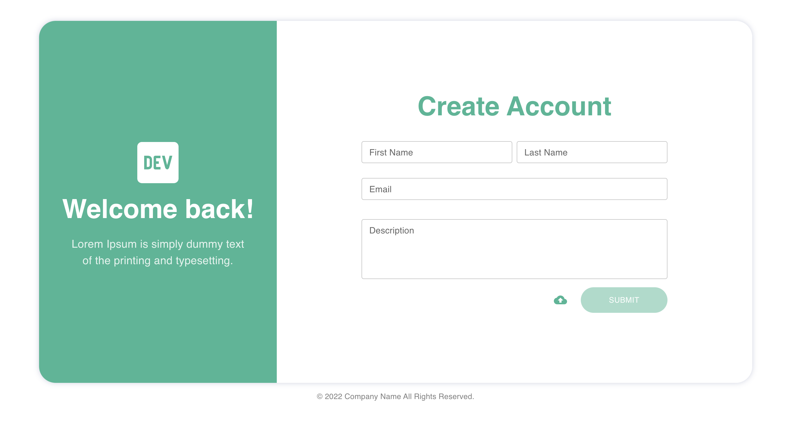
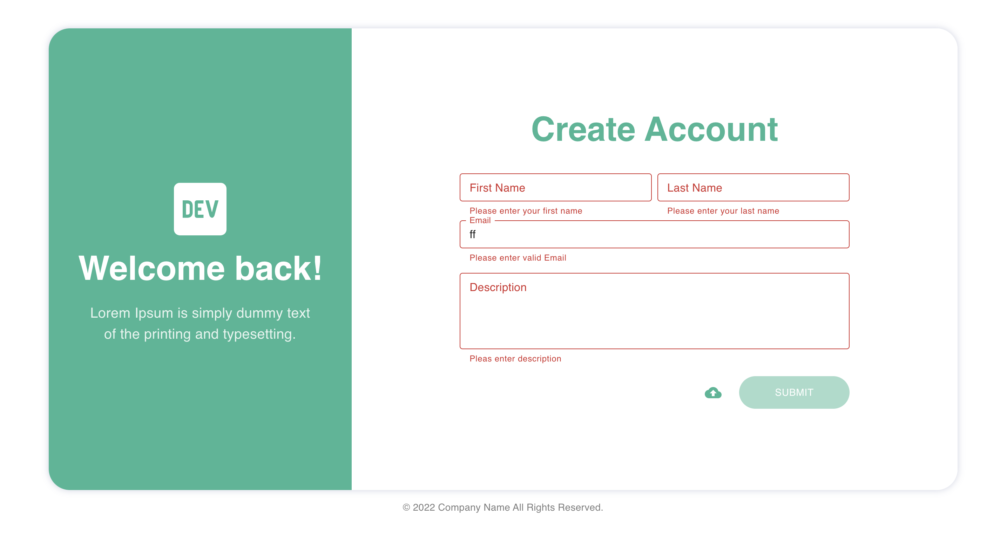
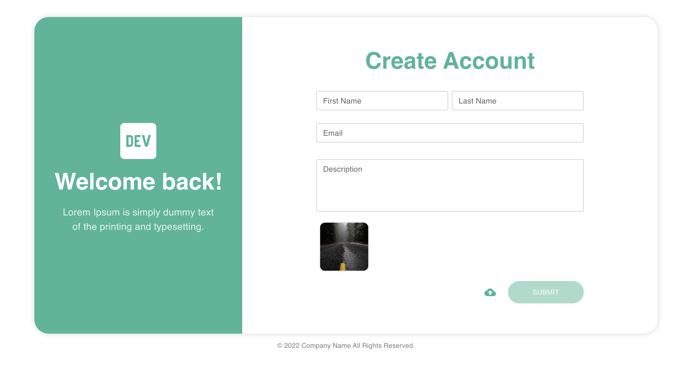
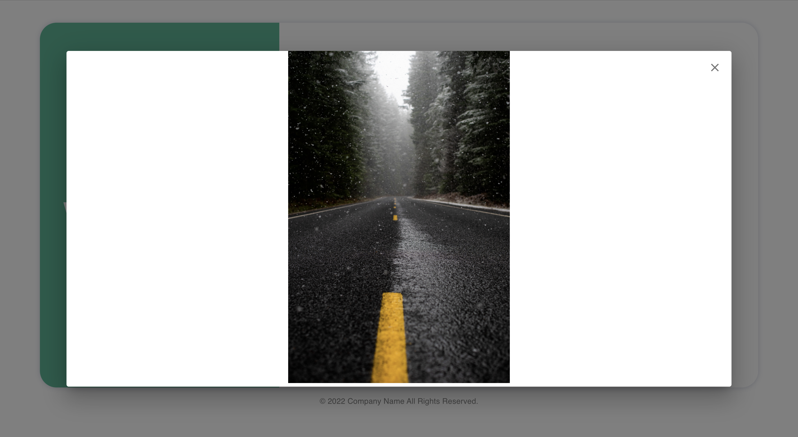
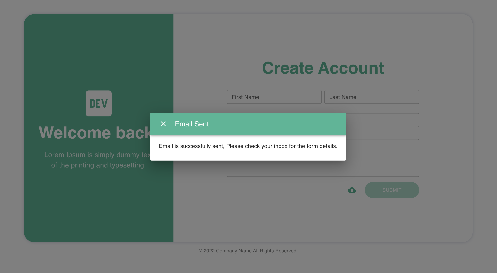
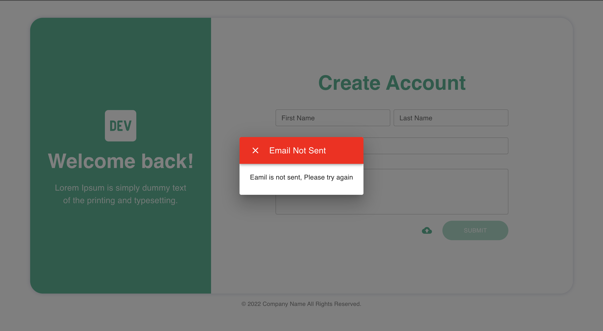
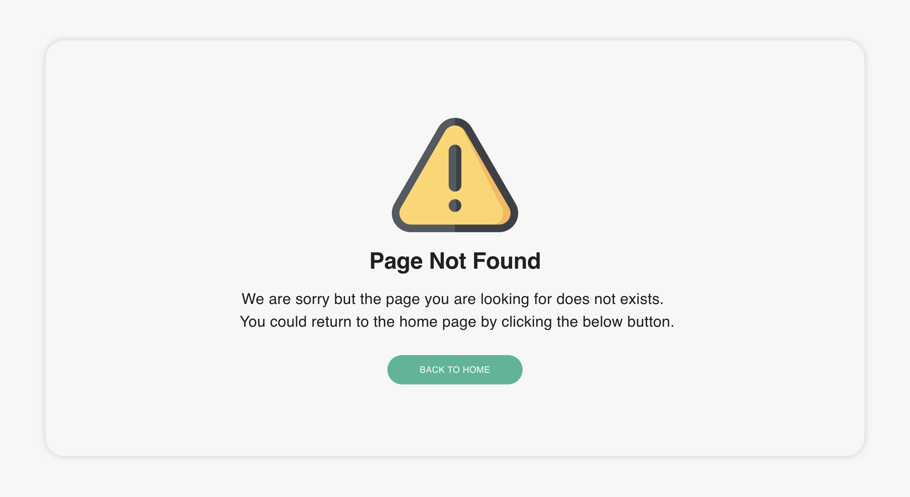

# About Application
This project allows us to create an account and preview photos. When the user submits the form, an email with the submitted data is sent to them. All user inputs are thoroughly validated, such as firstname and lastname, which are validated to allow only alphabets and spaces, and the email field, which is validated for the correct email format. The description field can contain any number of characters and symbols. Only images can be uploaded as files.

# How to install n run the application

Get the source code from github (https://github.com/mohamedafser/sgx-assesment.git). Alternatively, you can run the following commands in your terminal: 

`git clone https://github.com/mohamedafser/sgx-assesment.git`

# Begin front-end application with 
`cd #path` 

`npm install`
        
 or

`npm install ci`
 (to install only the exact version from package-lock.json)

After you've installed all of the required dependencies, you can launch the application by running the following command: 
`npm run start`

# Begin the Backend application
Go to the email server directory and run the following command:  
`cd src/services/emailServer`  
 and use this cmd to start the node js server.  
`node server.js`

# Technologies Used
* React router is used for url routing
* Material ui is used to create user interface,
* Node Mailer is used to send an email,
* Express for creating rest api server

# All validation steps to make the application success n failure case
All user inputs are thoroughly validated, such as 
firstname and lastname, which are validated to allow only alphabets and spaces, and the
email field, which is validated for the correct email format. 
The description field can contain any number of characters and symbols. 
File upload only images can be uploaded as files.

# Build the Frontend application
`npm run build`
Builds the app for production to the `build` folder.\
It correctly bundles React in production mode and optimizes the build for the best performance.

The build is minified and the filenames include the hashes.\
Your app is ready to be deployed!

See the section about [deployment](https://facebook.github.io/create-react-app/docs/deployment) for more information.

# Test Cases Hanlded
* If the first name is empty it shows "Please enter the first name"
* If the last name is empty it shows "Please enter the last name"
* If the email is empty it shows "Please enter the email and"
* If the user don't enter the valid email it shows "Please enter the valid email"
* If the description is empty it shows "Please enter desctiption"
* If all the input is entered and it's validation is passed, "submit button is enabled"
* If email send successfully it shows "Email is successfully sent, Please check your inbox for the form details".
* If email not sent it shows "Emil is not sent, Please try again"

# Screenshots
Welcome image

Input Fields Error

Upload Image

Uplaod Image Hover

Preview Image 

Email Sent

Email Not Sent

404 image

